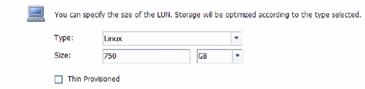

= Crie um LUN
:allow-uri-read: 
:icons: font
:imagesdir: ../media/

[role="lead"]
Você usa o assistente criar LUN para criar um LUN. O assistente também cria o grupo e mapeia o LUN para o grupo, o que permite que o host especificado acesse o LUN.

.Antes de começar
* Deve haver um agregado com espaço livre suficiente para conter o LUN.
* Deve haver uma máquina virtual de storage (SVM) com o protocolo FC ativado e as interfaces lógicas (LIFs) apropriadas criadas.
* Você deve ter registrado os nomes de portas mundiais (WWPNs) das portas FC do host.

.Sobre esta tarefa
Se sua organização tiver uma convenção de nomenclatura, você deve usar nomes para o LUN, volume e assim por diante que se encaixam na convenção. Caso contrário, você deve aceitar os nomes padrão.

.Passos
. Navegue até a janela *LUNs*.
. Selecione *criar.*
. PESQUISE e selecione um SVM no qual você deseja criar os LUNs.
+
É apresentado o Assistente para criar LUN.

. Na página *Propriedades Gerais*, selecione o tipo LUN *Linux* para LUNs usados diretamente pelo host Linux.
+
Deixe a caixa de seleção *Thin provisioned* desmarcada.

+

. Na página *contentor LUN*, selecione um FlexVol volume existente.
+
Você deve garantir que há espaço suficiente no volume. Se não houver espaço suficiente disponível nos volumes existentes, você poderá criar um novo volume.

. Na página *Mapeamento de iniciadores*, selecione *Adicionar Grupo de iniciadores*, insira as informações necessárias na guia *Geral* e, em seguida, na guia *iniciadores*, insira todas as WWPNs das portas FC do host que você gravou.
. Confirme os detalhes e selecione *Finish* para concluir o assistente.

*Informações relacionadas*

https://docs.netapp.com/us-en/ontap/system-admin/index.html["Administração do sistema"]
