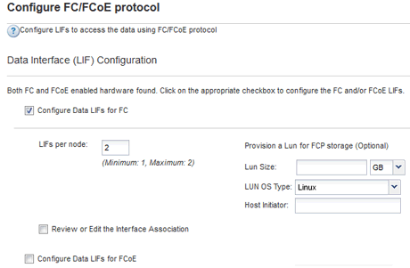

= Criar um novo SVM
:allow-uri-read: 
:icons: font
:imagesdir: ../media/

[role="lead"]
A máquina virtual de storage (SVM) fornece o destino FC por meio do qual um host acessa LUNs. Ao criar o SVM, você também cria interfaces lógicas (LIFs) e o LUN e seu volume contendo. É possível criar um SVM para separar os dados e as funções de administração de um usuário das dos outros usuários em um cluster.

.Antes de começar
* Sua malha FC precisa estar configurada e as portas físicas desejadas precisam ser conectadas à malha.

.Passos
. Navegue até a janela *SVMs*.
. Selecione *criar*.
. Na janela *Storage Virtual Machine (SVM) Setup*, crie o SVM:
+
image::../media/svm_setup_details_page_unix_selected_fc_rhel.gif[A ilustração mostra a criação de um SVM com estilo de segurança UNIX]

+
.. Especifique um nome exclusivo para o SVM.
+
O nome deve ser um nome de domínio totalmente qualificado (FQDN) ou seguir outra convenção que garanta nomes exclusivos em um cluster.

.. Selecione o IPspace ao qual o SVM pertencerá.
+
Se o cluster não usar vários IPspaces, o IPspace "'default'" será usado.

.. Mantenha a seleção padrão do tipo de volume.
+
Somente os volumes FlexVol são compatíveis com protocolos SAN.

.. Selecione todos os protocolos para os quais você tem licenças e que você pode usar no SVM, mesmo que você não queira configurar todos os protocolos imediatamente.
+
A seleção de NFS e CIFS ao criar o SVM permite que esses dois protocolos compartilhem as mesmas LIFs. Adicionar esses protocolos mais tarde não permite que eles compartilhem LIFs.

+
Se o CIFS for um dos protocolos selecionados, o estilo de segurança será definido como NTFS. Caso contrário, o estilo de segurança é definido como UNIX.

.. Mantenha a configuração de idioma padrão C.UTF-8.
.. Selecione o agregado raiz desejado para conter o volume raiz SVM.
+
O agregado para o volume de dados é selecionado separadamente em uma etapa posterior.

.. Selecione *Enviar e continuar*.

+
O SVM foi criado, mas os protocolos ainda não estão configurados.

. Se a página *Configurar protocolo CIFS/NFS* aparecer porque você ativou CIFS ou NFS, selecione *Ignorar* e configure CIFS ou NFS mais tarde.
. Se a página *Configurar protocolo iSCSI* for exibida porque você ativou iSCSI, selecione *Skip* e configure iSCSI posteriormente.
. Configure o serviço FC e crie LIFs, e o LUN e seu volume contendo a partir da página *Configurar protocolo FC/FCoE*:
+
.. Marque a caixa de seleção *Configure Data LIFs for FC*.
.. Digite `*2*` o campo *LIFs por nó*.
+
São necessárias duas LIFs para cada nó para garantir disponibilidade e mobilidade de dados.

.. Na área *provisione um LUN para armazenamento FCP*, insira o tamanho desejado do LUN, o tipo de host e WWPNs dos iniciadores do host.
.. Selecione *Enviar e continuar*.

+

. Quando a *SVM Administration* for exibida, configure ou defenda a configuração de um administrador separado para este SVM:
+
** Selecione *Skip* e configure um administrador mais tarde, se desejado.
** Introduza as informações solicitadas e selecione *Submit & Continue* (Enviar e continuar).

. Revise a página *Summary*, Registre as informações de LIF e selecione *OK*.

