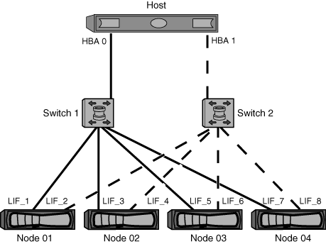

= Zone os switches FC pelo host e LIF WWPNs
:allow-uri-read: 
:icons: font
:imagesdir: ../media/

[role="lead"]
O zoneamento dos switches FC permite que os hosts se conetem ao storage e limita o número de caminhos. Você pode definir a zona dos switches usando a interface de gerenciamento dos switches.

.Antes de começar
* Você deve ter credenciais de administrador para os switches.
* Você deve conhecer o WWPN de cada porta do iniciador do host e de cada FC LIF para a máquina virtual de storage (SVM) na qual você criou o LUN.

.Sobre esta tarefa
Para obter detalhes sobre o zoneamento de seus switches, consulte a documentação do fornecedor do switch.

Você deve zona por WWPN, não por porta física. Cada porta do iniciador deve estar em uma zona separada com todas as portas de destino correspondentes.

Os LUNs são mapeados para um subconjunto dos iniciadores no igrop para limitar o número de caminhos do host para o LUN.

* Por padrão, o ONTAP usa o mapa de LUN seletivo para tornar o LUN acessível apenas por meio de caminhos no nó proprietário do LUN e de seu parceiro de HA.
* Você ainda precisa zonear todas as LIFs FC em cada nó para mobilidade de LUN, caso o LUN seja movido para outro nó no cluster.
* Ao mover um volume ou um LUN, você deve modificar a lista de nós de relatórios de mapa LUN seletivo antes de mover.

A ilustração a seguir mostra um host conetado a um cluster de quatro nós. Existem duas zonas, uma zona indicada pelas linhas sólidas e uma zona indicada pelas linhas tracejadas. Cada zona contém um iniciador do host e um LIF de cada nó de storage.

Você deve usar as WWPNs dos LIFs de destino, não as WWPNs das portas FC físicas nos nós de storage. Os WWPNs LIF estão todos no intervalo `2x:xx:00:a0:98:xx:xx:xx`, onde `x` é qualquer dígito hexadecimal. As portas físicas WWPNs estão todas no intervalo `50:0a:09:8x:xx:xx:xx:xx`.

.Passos
. Faça login no programa de administração do switch FC e selecione a opção de configuração de zoneamento.
. Crie uma nova zona que inclua o primeiro iniciador e todos os LIFs FC que se conetam ao mesmo switch FC que o iniciador.
. Crie zonas adicionais para cada iniciador de FC no host.
. Salve as zonas e, em seguida, ative a nova configuração de zoneamento.

