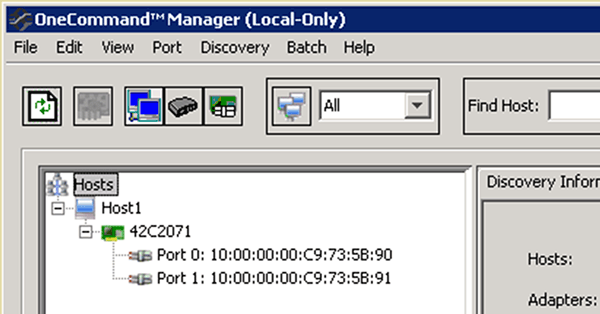

= Registre o WWPN para cada porta FC do host
:allow-uri-read: 
:icons: font
:imagesdir: ../media/

[role="lead"]
O nome da porta mundial (WWPN) é necessário para zonear os switches FC e criar os grupos que permitem que o host acesse seu LUN.

.Antes de começar
Você deve ter instalado o utilitário HBA do fornecedor para os HBAs em seu host e os HBAs verificados estão executando versões de driver, firmware e BIOS compatíveis para sua configuração.

.Sobre esta tarefa
O WWPN é usado para todas as configurações. Você não precisa Registrar o nome do nó mundial (WWNN).

.Passos
. Execute o utilitário HBA para o seu tipo FC HBA.
. Selecione o HBA.
. Registre o WWPN de cada porta.
+
O exemplo a seguir mostra o Emulex HBA Manager, anteriormente conhecido como OneCommand Manager.

+

+
Outros utilitários, como QLogic QConvergeConsole, fornecem as informações equivalentes.

. Repita a etapa anterior para cada FC HBA no host.

