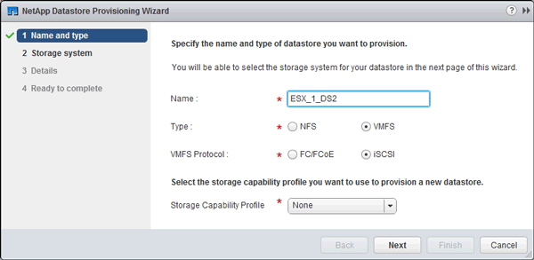

= Provisione um datastore e crie seu LUN e volume contendo
:allow-uri-read: 
:icons: font
:imagesdir: ../media/

[role="lead"]
Um datastore contém máquinas virtuais e seus VMDKs no host ESXi. O armazenamento de dados no host ESXi é provisionado em um LUN no cluster de armazenamento.

.Antes de começar
O Virtual Storage Console para VMware vSphere (VSC) deve ser instalado e registrado no vCenter Server que gerencia o host ESXi.

O VSC precisa ter credenciais suficientes de cluster ou máquina virtual de storage (SVM) para criar o LUN e o volume.

.Sobre esta tarefa
O VSC automatiza o provisionamento de armazenamento de dados, incluindo a criação de um LUN e volume na SVM especificada.

.Passos
. Na página vSphere Web Client *Home*, clique em *hosts and clusters*.
. No painel de navegação, expanda o datacenter onde você deseja provisionar o datastore.
. Clique com o botão direito do Mouse no host ESXi e selecione *NetApp VSC* > *armazenamento de dados de provisionamento*.
+
Como alternativa, você pode clicar com o botão direito do Mouse no cluster ao provisionar para tornar o datastore disponível para todos os hosts no cluster.

. Forneça as informações necessárias no assistente:
+

+
** Selecione *VMFS* como o tipo de datastore.
** Selecione *iSCSI* como o protocolo VMFS.
** Selecione *nenhum* como Perfil de capacidade de armazenamento.
** Selecione a caixa para *provisionamento fino*.
** Marque a caixa de seleção *criar novo volume*.

