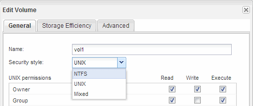

= Criar e configurar um volume
:allow-uri-read: 
:icons: font
:imagesdir: ../media/

[role="lead"]
Você deve criar um FlexVol volume para conter seus dados. Opcionalmente, você pode alterar o estilo de segurança padrão do volume, que é herdado do estilo de segurança do volume raiz. Você também pode alterar o local padrão do volume no namespace, que está no volume raiz da máquina virtual de storage (SVM).

.Passos
. Navegue até a janela *volumes*.
. Clique em *Create* > *Create FlexVol*.
+
A caixa de diálogo criar volume é exibida.

. Se quiser alterar o nome padrão, que termina em um carimbo de data e hora, especifique um novo nome, como `vol1` .
. Selecione um agregado para o volume.
. Especifique o tamanho do volume.
. Clique em *criar*.
+
Qualquer novo volume criado no System Manager é montado por padrão no volume raiz usando o nome do volume como o nome da junção. Você usa o caminho de junção e o nome da junção ao configurar compartilhamentos CIFS, e os clientes NFS usam o caminho de junção e o nome da junção ao montar o volume.

. *Opcional*: Se você não quiser que o volume esteja localizado na raiz do SVM, modifique o lugar do novo volume no namespace existente:
+
.. Navegue até a janela *namespace*.
.. Selecione *SVM* no menu suspenso.
.. Clique em *montar*.
.. Na caixa de diálogo *Mount volume*, especifique o volume, o nome de seu caminho de junção e o caminho de junção no qual você deseja que o volume seja montado.
.. Verifique o novo caminho de junção na janela *namespace*.
+
Se você quiser organizar certos volumes sob um volume principal chamado "data", você pode mover o novo volume "'vol1"" do volume raiz para o volume "data".

+
image::../media/namespace_1_before_nas_mp.gif[Este gráfico é descrito pelo texto circundante.]

. Reveja o estilo de segurança do volume e altere-o, se necessário:
+
.. Na janela *volume*, selecione o volume que acabou de criar e clique em *Editar*.
+
A caixa de diálogo Editar volume é exibida, mostrando o estilo de segurança atual do volume, que é herdado do estilo de segurança do volume raiz SVM.

.. Selecione o estilo de segurança que preferir e clique em *Salvar e fechar*.
+

