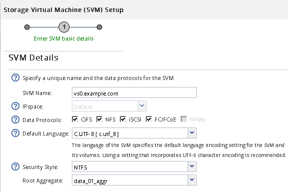

= Criar um SVM básico
:allow-uri-read: 
:icons: font
:imagesdir: ../media/

[role="lead"]
Você pode usar um assistente que o orienta no processo de criação de uma nova máquina virtual de armazenamento (SVM), configuração do sistema de nomes de domínio (DNS), criação de uma interface lógica de dados (LIF), configuração de um servidor CIFS, ativação do NFS e, opcionalmente, configuração do NIS.

.Antes de começar
* Sua rede deve estar configurada e as portas físicas relevantes devem estar conetadas à rede.
* Você deve saber quais dos seguintes componentes de rede o SVM usará:
+
** O nó e a porta específica nesse nó onde a interface lógica de dados (LIF) será criada
** A sub-rede a partir da qual o endereço IP do LIF de dados será provisionado ou, opcionalmente, o endereço IP específico que você deseja atribuir ao LIF de dados
** Domínio do ative Directory (AD) que este SVM associará, juntamente com as credenciais necessárias para adicionar o SVM a ele
** Informações sobre NIS, se o seu site usar NIS para serviços de nome ou mapeamento de nomes

* A sub-rede deve ser roteável para todos os servidores externos necessários para serviços como NIS (Network Information Service), LDAP (Lightweight Directory Access Protocol), AD (ative Directory) e DNS.
* Quaisquer firewalls externos devem ser adequadamente configurados para permitir o acesso a serviços de rede.
* O tempo nos controladores de domínio do AD, clientes e SVM deve ser sincronizado em até cinco minutos um do outro.

.Sobre esta tarefa
Ao criar um SVM para acesso multiprotocolo, você não deve usar as seções de provisionamento da janela Configuração da Máquina Virtual de Storage (SVM), que cria dois volumes, não um único volume com acesso multiprotocolo. Você pode provisionar o volume posteriormente no fluxo de trabalho.

.Passos
. Navegue até a janela *SVMs*.
. Clique em *criar.*
. Na caixa de diálogo *Storage Virtual Machine (SVM) Setup*, crie o SVM:
+
.. Especifique um nome exclusivo para o SVM.
+
O nome deve ser um nome de domínio totalmente qualificado (FQDN) ou seguir outra convenção que garanta nomes exclusivos em um cluster.

.. Selecione todos os protocolos para os quais você tem licenças e que você eventualmente usará no SVM, mesmo que você não queira configurar todos os protocolos imediatamente.
.. Mantenha a predefinição de idioma, C.UTF-8.
+
[NOTE]
====
Se você oferecer suporte à exibição de carateres internacionais em clientes NFS e SMB/CIFS, considere usar o código de idioma *UTF8MB4*, que está disponível a partir do ONTAP 9.5.

====
.. *Opcional*: Certifique-se de que o estilo de segurança está definido de acordo com sua preferência.
+
Selecionar o protocolo CIFS define o estilo de segurança como NTFS por predefinição.

.. *Opcional*: Selecione o agregado raiz para conter o volume raiz SVM.
+
O agregado selecionado para o volume raiz não determina o local do volume de dados. O agregado para o volume de dados é selecionado separadamente em uma etapa posterior.

+

.. *Opcional*: Na área *Configuração de DNS*, verifique se o domínio de pesquisa DNS padrão e os servidores de nomes são os que você deseja usar para este SVM.
+
image::../media/svm_setup_details_dns_nas_mp.gif[Este gráfico é explicado pelo texto circundante.]

.. Clique em *Enviar e continuar*.

+
O SVM foi criado, mas os protocolos ainda não estão configurados.

. Na seção *Configuração de LIF de dados* da página *Configurar protocolo CIFS/NFS*, especifique os detalhes do LIF que os clientes usarão para acessar dados:
+
.. Atribua um endereço IP ao LIF automaticamente a partir de uma sub-rede especificada ou introduza manualmente o endereço.
.. Clique em *Browse* e selecione um nó e uma porta que serão associados ao LIF.
+
image::../media/svm_setup_cifs_nfs_page_lif_multi_nas_nas_mp.gif[Este gráfico é descrito pelo texto circundante.]

. Na seção *Configuração do servidor CIFS*, defina o servidor CIFS e configure-o para acessar o domínio AD:
+
.. Especifique um nome para o servidor CIFS exclusivo no domínio AD.
.. Especifique o FQDN do domínio AD que o servidor CIFS pode ingressar.
.. Se você quiser associar uma unidade organizacional (ou) dentro do domínio do AD que não seja computadores CN, insira a UO.
.. Especifique o nome e a senha de uma conta administrativa que tenha Privileges suficiente para adicionar o servidor CIFS à UO.
.. Para evitar o acesso não autorizado a todos os compartilhamentos neste SVM, selecione a opção para criptografar dados usando o SMB 3,0.

+
image::../media/svm_setup_cifs_nfs_page_cifs_ad_nas_mp.gif[Este gráfico é descrito pelo texto circundante.]

. Ignore a área *provisione um volume para armazenamento CIFS* porque ele provisiona um volume apenas para acesso CIFS - não para acesso multiprotocolo.
. Se a área *NIS Configuration* estiver colapsada, expanda-a.
. Se o seu site usar NIS para serviços de nomes ou mapeamento de nomes, especifique o domínio e os endereços IP dos servidores NIS.
+
image::../media/svm_setup_cifs_nfs_page_nis_area_nas_mp.gif[Este gráfico é explicado pelo texto circundante.]

. Ignore a área *provisione um volume para armazenamento NFS* porque ele provisiona um volume somente para acesso NFS - não para acesso multiprotocolo.
. Clique em *Enviar e continuar*.
+
Os seguintes objetos são criados:

+
** Um LIF de dados nomeado após o SVM com o sufixo "'_cifs_nfs_lif1"
** Um servidor CIFS que faz parte do domínio AD
** Um servidor NFS

. Para todas as outras páginas de configuração de protocolo exibidas, clique em *Skip* e configure o protocolo mais tarde.
. Quando a página *SVM Administration* for exibida, configure ou defenda a configuração de um administrador separado para este SVM:
+
** Clique em *Skip* e configure um administrador mais tarde, se necessário.
** Insira as informações solicitadas e clique em *Submit & Continue*.

. Reveja a página *Summary*, registe qualquer informação que possa necessitar mais tarde e, em seguida, clique em *OK*.
+
O administrador DNS precisa saber o nome do servidor CIFS e o endereço IP do LIF de dados. Os clientes Windows precisam saber o nome do servidor CIFS. Os clientes NFS precisam saber o endereço IP do data LIF.

.Resultados
É criado um novo SVM que tenha um servidor CIFS e um servidor NFS acessíveis através do mesmo LIF de dados.

== O que fazer a seguir

Agora é necessário abrir a política de exportação do volume raiz da SVM.

*Informações relacionadas*

xref:task_opening_export_policy_svm_root_volume.adoc[Abertura da política de exportação do volume raiz da SVM (criação de um novo SVM habilitado para NFS)]
