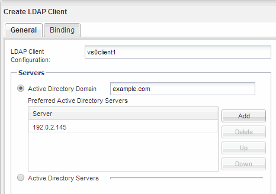
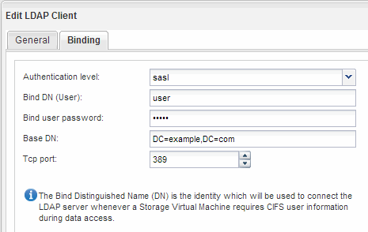

= Configurar LDAP (Configurar acesso NFS a uma SVM existente )
:allow-uri-read: 
:icons: font
:imagesdir: ../media/

[role="lead"]
Se você quiser que a máquina virtual de storage (SVM) obtenha informações de usuário do LDAP (Lightweight Directory Access Protocol) baseado no ative Directory, crie um cliente LDAP, ative-o para o SVM e dê prioridade LDAP sobre outras fontes de informações de usuário.

.Antes de começar
* A configuração LDAP deve estar usando o ative Directory (AD).
+
Se você usar outro tipo de LDAP, você deve usar a interface de linha de comando (CLI) e outra documentação para configurar o LDAP. Para obter mais informações, link:https://docs.netapp.com/us-en/ontap/nfs-config/using-ldap-concept.html["Visão geral do uso do LDAP"^]consulte .

* Você deve conhecer o domínio e os servidores do AD, bem como as seguintes informações de vinculação: O nível de autenticação, o usuário e a senha do Bind, o DN base e a porta LDAP.

.Passos
. Navegue até a janela *SVMs*.
. Selecione o SVM necessário
. Clique na guia *Configurações da SVM*.
. Configure um cliente LDAP para o SVM usar:
+
.. No painel *Serviços*, clique em *Cliente LDAP*.
.. Na janela *Configuração do cliente LDAP*, clique em *Adicionar*.
.. Na guia *Geral* da janela *criar cliente LDAP*, digite o nome da configuração do cliente LDAP, como `vs0client1` por exemplo .
.. Adicione o domínio AD ou os servidores AD.
+

.. Clique em *Binding* e especifique o nível de autenticação, o usuário Bind e a senha, o DN base e a porta.
+

.. Clique em *Salvar e fechar*.

+
Um novo cliente é criado e está disponível para uso do SVM.

. Habilite o novo cliente LDAP para o SVM:
+
.. No painel de navegação, clique em *Configuração LDAP*.
.. Clique em *Editar*.
.. Certifique-se de que o cliente que acabou de criar está selecionado em *Nome do cliente LDAP*.
.. Selecione *Ativar cliente LDAP* e clique em *OK*.
+
image::../media/ldap_svm_configuration_active_ldap_client_nfs.gif[Esta imagem é explicada pelo texto circundante.]

+
O SVM usa o novo cliente LDAP.

. Dê prioridade ao LDAP sobre outras fontes de informações do usuário, como o Network Information Service (NIS) e usuários e grupos locais:
+
.. Navegue até a janela *SVMs*.
.. Selecione o SVM e clique em *Editar*.
.. Clique na guia *Serviços*.
.. Em *Name Service Switch*, especifique *LDAP* como a origem preferencial do switch de serviço de nomes para os tipos de banco de dados.
.. Clique em *Salvar e fechar*.

+
image::../media/name_services_ldap_priority_nfs.gif[Este gráfico é descrito pelo texto circundante.]

+
O LDAP é a principal fonte de informações do usuário para serviços de nome e mapeamento de nomes neste SVM.

