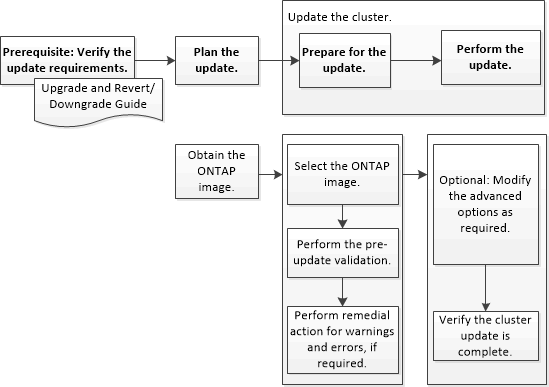

= Atualize clusters em uma configuração que não seja MetroCluster com o System Manager - ONTAP 9.7 e anterior
:allow-uri-read: 
:icons: font
:imagesdir: ../media/

[role="lead"]
Você pode usar o ONTAP System Manager classic (disponível no ONTAP 9.7 e anterior) para atualizar um cluster ou os nós individuais em um par de alta disponibilidade (HA). Para executar uma atualização, você deve selecionar uma imagem ONTAP, validar se o cluster ou os nós individuais no par de HA estão prontos para a atualização e, em seguida, executar a atualização.

*Informações relacionadas*

https://docs.netapp.com/us-en/ontap/upgrade/task_upgrade_andu_sm.html["Atualize ONTAP"]
