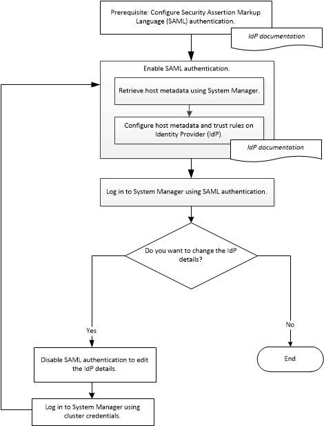

= Configure a autenticação SAML com o Gerenciador de sistema - ONTAP 9.7 e anterior
:allow-uri-read: 
:icons: font
:imagesdir: ../media/

[role="lead"]
Você pode usar o ONTAP System Manager classic (disponível no ONTAP 9.7 e anterior) para configurar a autenticação SAML (Security Assertion Markup Language). Os usuários remotos são autenticados por meio de um provedor de identidade seguro (IDP) antes de fazer login no System Manager.

== Ativar a autenticação SAML

Você pode usar o System Manager para configurar a autenticação SAML (Security Assertion Markup Language) para que os usuários remotos possam fazer login usando um provedor de identidade seguro (IDP).

.Antes de começar
* O IDP que pretende utilizar para autenticação remota tem de ser configurado.
+
[NOTE]
====
Consulte a documentação fornecida pelo IDP que você configurou.

====
* Você deve ter o URI do IDP.

.Sobre esta tarefa
Os seguintes IDPs foram validados com o System Manager:

* Serviços de Federação do ative Directory
* Cisco Duo (validado com as seguintes versões do ONTAP:)
+
** 9.7P21 e versões posteriores do 9,7
** 9.8P17 e versões posteriores do 9,8
** 9,9.1P13 e versões posteriores do 9,9
** 9.10.1P9 e versões posteriores do 9,10
** 9.11.1P4 e versões posteriores do 9,11
** 9.12.1 e versões posteriores

* Shibboleth

[NOTE]
====
Depois que a autenticação SAML estiver ativada, somente usuários remotos poderão acessar a GUI do System Manager. Os usuários locais não podem acessar a GUI do System Manager depois que a autenticação SAML estiver ativada.

====
.Passos
. Clique em *Configuração* > *Cluster* > *Autenticação*.
. Marque a caixa de seleção *Ativar autenticação SAML* .
. Configure o System Manager para usar a autenticação SAML:
+
.. Introduza o URI do IDP.
.. Introduza o endereço IP do sistema anfitrião.
.. *Opcional:* se necessário, altere o certificado do sistema host.

. Clique em *Retrieve Host Metadata* para recuperar a URI do host e as informações de metadados do host.
. Copie os detalhes do URI do host ou dos metadados do host, acesse seu IDP e especifique os detalhes do URI do host ou dos metadados do host e as regras de confiança na janela do IDP.
+
[NOTE]
====
Consulte a documentação fornecida pelo IDP que você configurou.

====
. Clique em *Salvar*.
+
É apresentada a janela de início de sessão do IDP.

. Inicie sessão no System Manager utilizando a janela de início de sessão do IDP.
+
Depois que o IDP for configurado, se o usuário tentar fazer login usando o nome de domínio totalmente qualificado (FQDN), IPv6 ou um LIF de gerenciamento de cluster, o sistema mudará automaticamente o endereço IP para o endereço IP do sistema host que foi especificado durante a configuração do IDP.

== Desativar a autenticação SAML

Você pode desativar a autenticação SAML (Security Assertion Markup Language) se quiser desativar o acesso remoto ao System Manager ou editar a configuração SAML.

.Sobre esta tarefa
A desativação da autenticação SAML não exclui a configuração SAML.

.Passos
. Clique em *Configuração* > *Cluster* > *Autenticação*.
. Desmarque a caixa de seleção *Ativar autenticação SAML* .
. Clique em *Salvar*.
+
O System Manager é reiniciado.

. Faça login no System Manager usando as credenciais do cluster.

*Informações relacionadas*

xref:task_accessing_cluster_by_using_system_manager_brower_based_gui.adoc[Acessar um cluster usando a interface gráfica baseada no navegador do Gerenciador de sistema do ONTAP]
