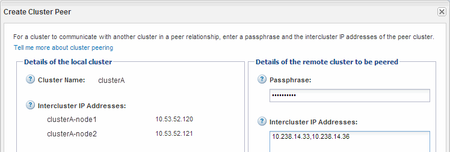

= Criar um relacionamento de pares de cluster (ONTAP 9.2 ou anterior)
:allow-uri-read: 
:icons: font
:imagesdir: ../media/

[role="lead"]
Usando a interface _classic_ do Gerenciador de sistema do ONTAP com o ONTAP 9.2 ou uma versão anterior do ONTAP 9, você pode criar uma relação de cluster entre dois clusters inserindo uma senha predeterminada e os endereços IP das LIFs entre clusters do cluster remoto e, em seguida, verificando se a relação foi criada com sucesso.

.Antes de começar
* Você deve saber os endereços IP de todos os LIFs entre clusters dos clusters que você deseja fazer peer.
* Você deve saber a senha que você usará para cada relacionamento de pares.

.Sobre esta tarefa
Tem de executar este procedimento em cada cluster.

.Passos
. A partir do cluster de origem, crie uma relação de peer de cluster com o cluster de destino.
+
.. Clique na guia *Configurações*.
.. No painel *Configurações de cluster*, clique em *pares de cluster*.
.. Clique em *criar*.
+
A caixa de diálogo *Create Cluster Peer* é exibida.

.. [[step1d-passphrase-used]]na área *Detalhes do cluster remoto a ser peered*, especifique a frase-passe que ambos os pares usarão para garantir um relacionamento de pares de cluster autenticado.
.. Insira os endereços IP de todos os LIFs entre clusters do cluster de destino (um por nó) separados por vírgulas.
+

.. Clique em *criar*.
+
O status de autenticação é "'pendente'" porque apenas um cluster foi configurado.

. Mude para o cluster de destino e, em seguida, crie uma relação de cluster com o cluster de origem:
+
.. Clique na guia *Configurações*.
.. No painel *Configurações de cluster*, clique em *pares de cluster*.
.. Clique em *criar*.
+
A caixa de diálogo criar ponto de cluster é exibida.

.. Na área *Detalhes do cluster remoto a ser peered*, especifique a mesma senha que você especificou <<step1d-passphrase-used,Passo 1D>>e os endereços IP das LIFs entre clusters do cluster de origem e clique em *Create*.

+
image::../media/cluster_peer_create_2.gif[Esta imagem é explicada pelo texto circundante.]

. Na janela *Cluster Peers* do cluster de destino, confirme se o cluster de origem está "'disponível'" e se o status de autenticação é "'OK'".
+
image::../media/cluster_peers_status.gif[Esta imagem é explicada pelo texto circundante.]

+
Talvez seja necessário clicar em *Refresh* para exibir as informações atualizadas.

+
Os dois clusters estão em um relacionamento de pares.

. Mude para o cluster de origem e confirme se o cluster de destino está "'disponível'" e se o status de autenticação é "'OK'".
+
Talvez seja necessário clicar em *Refresh* para exibir as informações atualizadas.

== O que fazer a seguir

Crie uma relação entre os SVMs de origem e destino enquanto cria uma relação de proteção de dados entre o volume de origem e o volume de destino.

link:../volume-backup-snapvault/index.html["Backup de volume usando o SnapVault"]

link:../volume-disaster-recovery/index.html["Preparação para recuperação de desastres em volume"]
