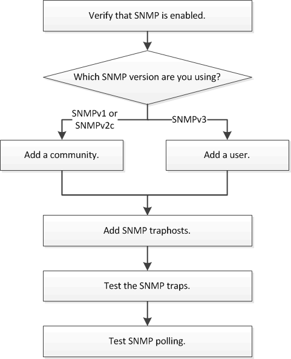

= Fluxo de trabalho de configuração SNMP
:allow-uri-read: 
:icons: font
:imagesdir: ../media/

[role="lead"]
Configurar o SNMP envolve a ativação do SNMP, configurar opcionalmente uma comunidade SNMPv1 ou SNMPv2c, adicionando opcionalmente um usuário SNMPv3, adicionando traphosts SNMP e testando polling e traps SNMP.

