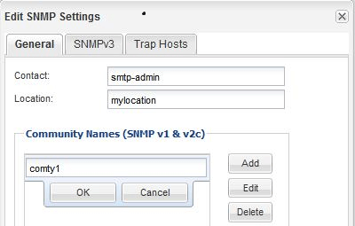

= Adicione uma comunidade SNMP
:allow-uri-read: 
:icons: font
:imagesdir: ../media/

[role="lead"]
Você pode usar a interface _classic_ do Gerenciador de sistema do ONTAP com o ONTAP 9.7 ou anterior para adicionar uma comunidade à máquina virtual de armazenamento administrativo (SVM) para um cluster que esteja executando SNMPv1 ou SNMPv2c. O System Manager usa os protocolos SNMP SNMPv1 e SNMPv2c e uma comunidade SNMP para descobrir sistemas de armazenamento.

.Sobre esta tarefa
Este procedimento destina-se a adicionar uma comunidade SNMP ao SVM administrativo para o cluster. O procedimento para adicionar uma comunidade SNMP a um SVM de dados é descrito em https://docs.netapp.com/us-en/ontap/networking/index.html["Gerenciamento de rede"].

Em novas instalações do ONTAP, o SNMPv1 e o SNMPv2c são desativados por padrão. SNMPv1 e SNMPv2c são ativados quando você cria uma comunidade SNMP.

.Passos
. Na janela SNMP, clique em *Editar* para abrir a caixa de diálogo *Editar configurações SNMP*.
. Na guia *Geral*, especifique o pessoal de Contato e o local do sistema ONTAP.
. Clique em *Add*, insira um nome de comunidade e clique em *OK* no painel *Community Names*.
+
Você pode adicionar vários nomes de comunidade. Um nome de comunidade pode ter no máximo 32 carateres e não deve conter os seguintes carateres especiais: `, / : " ' |`

+

. Quando terminar de adicionar nomes de comunidade, clique em *OK* na caixa de diálogo *Editar configurações SNMP*.

