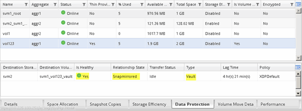

= Criar a relação SnapVault (ONTAP 9 .2 ou anterior)
:allow-uri-read: 
:icons: font
:imagesdir: ../media/

[role="lead"]
É necessário criar uma relação de SnapVault entre o volume de origem em um cluster e o volume de destino no cluster com permissões para criar um backup do SnapVault.

.Antes de começar
* Tem de ter o nome de utilizador e a palavra-passe do administrador do cluster para o cluster de destino.
* O agregado de destino deve ter espaço disponível.

.Sobre esta tarefa
Você deve executar esta tarefa a partir do cluster *source*.

.Passos
. Clique em *Storage* > *SVMs*.
. Selecione o SVM e clique em *Configurações do SVM*.
. Clique na guia *volumes*.
. Selecione o volume que deseja fazer backup e clique em *proteger*.
. Na caixa de diálogo *criar relação de proteção*, selecione *Vault* na lista suspensa *tipo de relação*.
. Na seção *volume de destino*, selecione o cluster de Contatos.
. Especifique o SVM para o volume de destino:
+
|===
| Se o SVM for... | Então... 

 a| 
Peered
 a| 
Selecione a SVM com peering na lista.

 a| 
Não peered
 a| 
.. Selecione o SVM.
.. Clique em *Authenticate*.
.. Insira as credenciais do administrador do cluster do cluster com permissões e clique em *criar*.

|===
. Criar um novo volume de destino:
+
.. Selecione a opção *novo volume*.
.. Utilize o nome do volume predefinido ou introduza um novo nome de volume.
.. Selecione o agregado de destino.
.. Certifique-se de que a caixa de verificação *Ativar deduplicação* está selecionada.

+
image::../media/dest_vol_snapvault.gif[separador volume de destino de configuração com a caixa de verificação ativar deduplicação]

. Na seção *Detalhes da configuração*, `XDPDefault` selecione como a política de proteção.
. Selecione um programa de proteção na lista de programações.
. Certifique-se de que a caixa de verificação *Initialize Relationship* está selecionada para transferir a cópia Snapshot base e, em seguida, clique em *Create*
+
image::../media/config_details_snapvault.gif[separador detalhes da configuração com caixa de verificação inicializar relação]

+
O assistente cria a relação com a política e a programação do Vault especificados. A relação é inicializada iniciando uma transferência de linha de base de dados do volume de origem para o volume de destino.

+
A secção Estado mostra o estado de cada trabalho.

+
image::../media/create_snapvault_success.gif[criar a guia relação de proteção com a seção de status mostrando o status de cada trabalho]

. Verifique se o status do relacionamento do SnapVault está no `Snapmirrored` estado.
+
.. Selecione o volume na lista volumes e clique em *proteção de dados*.
.. Na guia inferior *proteção de dados*, verifique se a relação SnapMirror criada está listada e o estado da relação é `Snapmirrored` e tipo é `Vault`.
+

