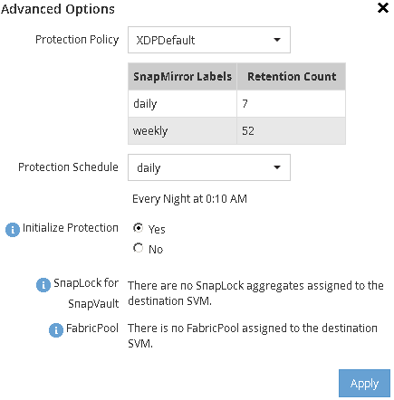

= Criar um relacionamento SnapVault (começando com ONTAP 9.3)
:allow-uri-read: 
:icons: font
:imagesdir: ../media/

[role="lead"]
É necessário criar uma relação de SnapVault entre o volume de origem em um cluster e o volume de destino no cluster com permissões para criar um backup do SnapVault.

.Antes de começar
* Tem de ter o nome de utilizador e a palavra-passe do administrador do cluster para o cluster de destino.
* O agregado de destino deve ter espaço disponível.

.Sobre esta tarefa
Você deve executar esta tarefa a partir do cluster *source*.

.Passos
. Clique em *Storage* > *volumes*.
. Selecione o volume que pretende efetuar uma cópia de segurança e, em seguida, clique em *ações* > *proteger*.
+
Você também pode selecionar vários volumes de origem e criar relacionamentos do SnapVault com um único volume de destino.

. Na página *volumes: Proteger volumes*, forneça as seguintes informações:
+
.. Selecione *Vault* na lista suspensa *tipo de relacionamento*.
.. Selecione o cluster de destino, o SVM de destino e o sufixo para o volume de destino.
+
Somente SVMs com peered e SVMs permitidas são listadas em SVMs de destino.

+
O volume de destino é criado automaticamente. O nome do volume de destino é o nome do volume de origem anexado com o sufixo.

.. Clique image:../media/advanced_options_icon_backup.gif[""]em .
.. Na caixa de diálogo *Opções avançadas*, verifique se a *Política de proteção* está definida como `XDPDefault`.
.. Selecione o *Programa de proteção*.
+
Por padrão, o `daily` agendamento é selecionado.

.. Verifique se *Yes* está selecionado para inicializar a relação SnapVault.
+
Todas as relações de proteção de dados são inicializadas por padrão.

.. Clique em *Apply* para salvar as alterações.
+

. Na página *volumes: Proteger volumes*, clique em *Validar* para verificar se os volumes têm rótulos SnapMirror correspondentes.
. Clique em *Salvar* para criar a relação SnapVault.
. Verifique se o status da relação SnapVault está no `Snapmirrored` estado.
+
.. Navegue até a janela *volumes* e, em seguida, selecione o volume que está em backup.
.. Expanda o volume e clique em *PROTECTION* para visualizar o estado de proteção de dados do volume.

+
image::../media/snapvault_9_3.gif[janela volumes mostrando o status de proteção de dados do volume]

