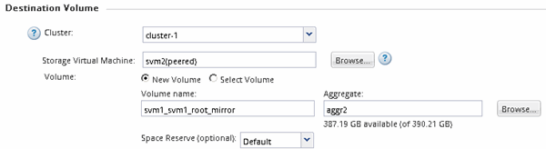

= Criar a relação SnapMirror (ONTAP 9 .2 ou anterior)
:allow-uri-read: 
:icons: font
:imagesdir: ../media/

[role="lead"]
É necessário criar uma relação de SnapMirror entre o volume de origem em um cluster e o volume de destino no cluster com permissões para replicação de dados para recuperação de desastres.

.Antes de começar
* Tem de ter o nome de utilizador e a palavra-passe do administrador do cluster para o cluster de destino.
* O agregado de destino deve ter espaço disponível.
* Ambos os clusters precisam ser configurados e configurados adequadamente para atender aos requisitos do ambiente de acesso do usuário, autenticação e acesso do cliente.

.Sobre esta tarefa
Você deve executar esta tarefa a partir do cluster *source*.

.Passos
. Clique em *Storage* > *SVMs*.
. Selecione o SVM e clique em *Configurações do SVM*.
. Clique na guia *volumes*.
. Selecione o volume para o qual você deseja criar uma relação de espelho e clique em *Protect*.
+
A janela criar relação de proteção é exibida.

. Na seção *tipo de relacionamento*, selecione *espelho* na lista suspensa *tipo de relacionamento*.
. Na seção *volume de destino*, selecione o cluster de Contatos.
. Especifique o SVM para o volume de destino:
+
|===
| Se o SVM for... | Então... 

 a| 
Peered
 a| 
Selecione a SVM com peering na lista.

 a| 
Não peered
 a| 
.. Selecione o SVM.
.. Clique em *Authenticate*.
.. Insira as credenciais do administrador do cluster do cluster com permissões e clique em *criar*.

|===
. Criar um novo volume de destino:
+
.. Selecione a opção *novo volume*.
.. Use o nome do volume padrão ou especifique um novo nome de volume.
.. Selecione o agregado de destino.

+

. Na seção *Detalhes da configuração*, selecione *MirrorAllSnapshots* como a política de espelhamento.
+
`DPDefault` E `MirrorLatest` são as outras políticas de espelhamento padrão que estão disponíveis para relacionamentos SnapMirror.

. Selecione um programa de proteção na lista de programações.
. Certifique-se de que a caixa de verificação *Initialize Relationship* está selecionada e, em seguida, clique em *Create*.
+
A inicialização do relacionamento SnapMirror garante que o volume de destino tenha uma linha de base para começar a proteger o volume de origem.

+
image::../media/create_snapmirror_relationship_window.gif[Criar janela SnapMirror]

+
A relação é inicializada iniciando uma transferência de linha de base de dados do volume de origem para o volume de destino.

+
A operação de inicialização pode levar algum tempo. A secção Estado mostra o estado de cada trabalho.

+
image::../media/snapmirror_create_3_successful.gif[Criar SnapMirror bem-sucedido]

. Verifique o status do relacionamento do SnapMirror:
+
.. Selecione o volume para o qual você criou a relação SnapMirror na lista *volumes* e clique em *proteção de dados*.
.. Na guia *proteção de dados*, verifique se a relação do SnapMirror que você criou está listada e se o estado do relacionamento é `Snapmirrored`.
+
image::../media/snapmirror_create_4_verify.gif[Verifique se a relação foi criada]

== O que fazer a seguir

Você deve observar as configurações do volume de origem, como thin Provisioning, deduplicação, compactação e crescimento automático. Você pode usar essas informações para verificar as configurações de volume de destino ao interromper a relação do SnapMirror.
