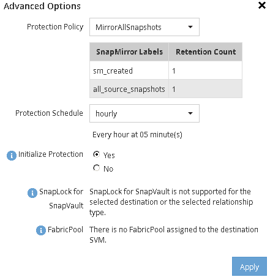

= Criar a relação SnapMirror (começando com ONTAP 9.3)
:allow-uri-read: 
:icons: font
:imagesdir: ../media/

[role="lead"]
É necessário criar uma relação de SnapMirror entre o volume de origem em um cluster e o volume de destino no cluster com permissões para replicação de dados para recuperação de desastres.

.Antes de começar
* O agregado de destino deve ter espaço disponível.
* Ambos os clusters precisam ser configurados e configurados adequadamente para atender aos requisitos do ambiente de acesso do usuário, autenticação e acesso do cliente.

.Sobre esta tarefa
Você deve executar esta tarefa a partir do cluster *source*.

.Passos
. Clique em *Storage* > *volumes*.
. Selecione o volume para o qual deseja criar uma relação de espelho e clique em *ações* > *proteger*.
. Na seção *tipo de relacionamento*, selecione *espelho* na lista suspensa *tipo de relacionamento*.
. Na página *volumes: Proteger volumes*, forneça as seguintes informações:
+
.. Selecione *Mirror* como tipo de relacionamento.
.. Selecione o cluster de destino, o SVM de destino e o sufixo para o nome do volume de destino.
+
Somente SVMs com peered e SVMs permitidas são listadas em SVMs de destino.

.. Clique em .
.. Na caixa de diálogo *Opções avançadas*, verifique se `MirrorAllSnapshots` está definido como a política de proteção.
+
`DPDefault` E `MirrorLatest` são as outras políticas de proteção padrão disponíveis para relacionamentos SnapMirror.

.. Selecione um plano de proteção.
+
Por padrão, o `hourly` agendamento é selecionado.

.. Verifique se *Yes* está selecionado para inicializar a relação SnapVault.
+
Todas as relações de proteção de dados são inicializadas por padrão. A inicialização do relacionamento SnapMirror garante que o volume de destino tenha uma linha de base para começar a proteger o volume de origem.

.. Clique em *Apply* para salvar as alterações.
+

. Clique em *Salvar* para criar a relação SnapMirror.
. Verifique se o status do relacionamento do SnapMirror está no `Snapmirrored` estado.
+
.. Navegue até a janela *volumes* e selecione o volume para o qual você criou a relação SnapMirror.
.. Clique duas vezes no volume para ver os detalhes do volume e, em seguida, clique em *PROTECTION* para ver o estado de proteçãoão de dados do volume.

+
image::../media/snapmirror_9_3.gif[Captura de tela de status do SnapMirror]

== O que fazer a seguir

Você deve observar as configurações do volume de origem, como thin Provisioning, deduplicação, compactação e crescimento automático. Você pode usar essas informações para verificar as configurações de volume de destino ao interromper a relação do SnapMirror.
