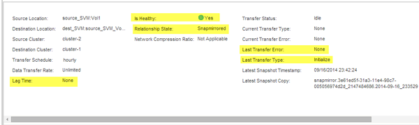

= Monitore o status das transferências de dados do SnapMirror
:allow-uri-read: 
:icons: font
:imagesdir: ../media/

[role="lead"]
Você deve monitorar periodicamente o status das relações do SnapMirror para garantir que as transferências de dados do SnapMirror estejam ocorrendo de acordo com o cronograma especificado.

.Sobre esta tarefa
Você deve executar esta tarefa a partir do cluster *Destination*.

.Passos
. Dependendo da versão do System Manager que você está executando, execute uma das seguintes etapas:
+
** ONTAP 9.4 ou anterior: Clique em *proteção* > *relacionamentos*.
** Começando com ONTAP 9.5: Clique em *proteção* > *relacionamentos de volume*.

. Selecione a relação SnapMirror entre os volumes de origem e destino e verifique o status na guia inferior *Detalhes*.
+
A guia Detalhes exibe o status de integridade da relação SnapMirror e mostra os erros de transferência e o tempo de atraso.

+
** O campo está saudável deve exibir `Yes`.
+
Para a maioria das falhas de transferência de dados do SnapMirror, o campo `No` exibe . Em alguns casos de falha, no entanto, o campo continua a exibir `Yes`. Você deve verificar os erros de transferência na seção Detalhes para garantir que nenhuma falha de transferência de dados ocorreu.

** O campo Estado da relação deve exibir `Snapmirrored`.
** O tempo de atraso não deve ser superior ao intervalo de programação de transferência.
+
Por exemplo, se o agendamento de transferência for de hora em hora, o tempo de atraso não deve ser superior a uma hora.

+
Você deve solucionar qualquer problema nas relações do SnapMirror.

+
http://www.netapp.com/us/media/tr-4015.pdf["Relatório técnico da NetApp 4015: Configuração do SnapMirror e melhores práticas para o ONTAP 9.1, 9,2"^]

+

