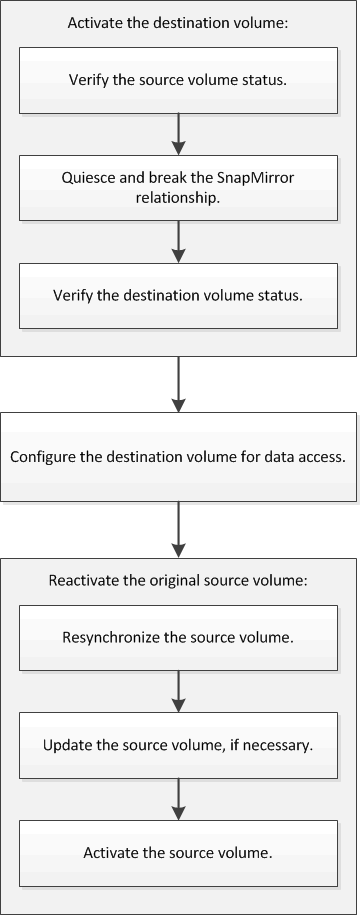

= Fluxo de trabalho de recuperação de desastre de volume
:allow-uri-read: 
:icons: font
:imagesdir: ../media/

[role="lead"]
O fluxo de trabalho de recuperação de desastre de volume inclui ativar o volume de destino, configurar o volume de destino para acesso aos dados e reativar o volume de origem original.

Informações adicionais estão disponíveis para ajudá-lo a gerenciar os relacionamentos de recuperação de desastres em nível de volume e fornece outros métodos de recuperação de desastres para proteger a disponibilidade de seus recursos de dados.

* xref:../volume-backup-snapvault/index.html[Backup de volume usando o SnapVault]
+
Descreve como configurar rapidamente as relações do Vault de backup entre volumes localizados em diferentes clusters do ONTAP.

* xref:../volume-restore-snapvault/index.html[Gerenciamento de restauração de volume usando o SnapVault]
+
Descreve como restaurar rapidamente um volume a partir de um cofre de backup no ONTAP.

