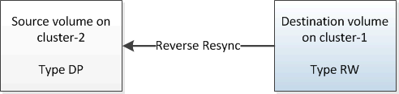

= Ressincronize o volume de origem
:allow-uri-read: 
:icons: font
:imagesdir: ../media/

[role="lead"]
Quando o volume de origem estiver on-line, você deverá ressincronizar os dados entre o volume de destino e o volume de origem para replicar os dados mais recentes do volume de destino.

.Antes de começar
O volume de origem deve estar online.

.Sobre esta tarefa
Você deve executar a tarefa a partir do cluster *Destination*.

A imagem a seguir mostra que os dados são replicados do volume de destino ativo para o volume de origem somente leitura:

.Passos
. Dependendo da versão do System Manager que você está executando, execute uma das seguintes etapas:
+
** ONTAP 9.4 ou anterior: Clique em *proteção* > *relacionamentos*.
** Começando com ONTAP 9.5: Clique em *proteção* > *relacionamentos de volume*.

. Selecione a relação SnapMirror entre os volumes de origem e destino.
. Anote o agendamento de transferência e a política configurada para a relação SnapMirror.
. Clique em *Operations* > *Reverse Resync*.
. Marque a caixa de seleção de confirmação e clique em *Reverse Resync*.
+
image::../media/reverse_resync_4eea.gif[Ecrã de ressincronização inversa]

+
A partir de ONTAP 9.3, a política SnapMirror da relação é definida como `MirrorAllSnapshots` e a programação espelhada é definida `None` como .

+
Se você estiver executando o ONTAP 9.2 ou anterior, a política SnapMirror da relação será definida como `DPDefault` e a programação espelhada será definida `None` como .

. No cluster de origem, especifique uma política e programação SnapMirror que correspondam à configuração de proteção do relacionamento SnapMirror original:
+
.. Dependendo da versão do System Manager que você está executando, execute uma das seguintes etapas:
+
*** ONTAP 9.4 ou anterior: Clique em *proteção* > *relacionamentos*.
*** Começando com ONTAP 9.5: Clique em *proteção* > *relacionamentos de volume*.

.. Selecione a relação SnapMirror entre o volume de origem ressincronizado e o volume de destino e clique em *Editar*.
.. Selecione a política e a programação do SnapMirror e clique em *OK*.

