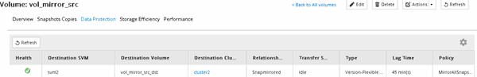

= Verifique o status do volume de origem
:allow-uri-read: 
:icons: font
:imagesdir: ../media/

[role="lead"]
Quando o volume de origem não estiver disponível, você deve verificar se o volume de origem está off-line e, em seguida, identificar o volume de destino que deve ser ativado para fornecer acesso aos dados.

.Sobre esta tarefa
Você deve executar esta tarefa a partir do cluster *source*.

.Passos
. Navegue até a janela *volumes*.
. Selecione o volume de origem e verifique se o volume de origem está offline.
. Identifique o volume de destino na relação SnapMirror.
+
** Começando com ONTAP 9.3: Clique duas vezes no volume de origem para visualizar os detalhes e clique em *PROTECTION* para identificar o volume de destino na relação SnapMirror e o nome do SVM que contém o volume.
+

** ONTAP 9.2 ou anterior: Clique na guia *proteção de dados* na parte inferior da página volumes para identificar o volume de destino na relação SnapMirror e o nome da SVM que contém o volume.
+
image::../media/volume_status_2.gif[A imagem mostra o volume de destino]

