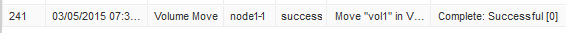

= Mover um volume usando o System Manager
:allow-uri-read: 
:icons: font
:imagesdir: ../media/

[role="lead"]
Usando a interface _classic_ do Gerenciador de sistema do ONTAP com o ONTAP 9.7 ou anterior, você pode mover um volume selecionando um volume e o agregado de destino, iniciando a operação de movimentação de volume e, opcionalmente, monitorando a tarefa de movimentação de volume. Ao usar o System Manager, uma operação de movimentação de volume é concluída automaticamente.

.Antes de começar
Você deve ter revisado o espaço disponível no agregado de origem e no agregado de destino antes da operação de movimentação de volume e após a operação de movimentação de volume.

.Sobre esta tarefa
Uma operação de movimentação de volume é suportada apenas dentro do mesmo cluster. Além disso, observe que o agregado para o qual você está movendo o volume e o agregado do qual está movendo o volume devem estar na mesma máquina virtual de storage (SVM). Uma movimentação de volume não interrompe o acesso do cliente.

.Passos
. Navegue até a janela *volumes*.
. Selecione o volume que pretende mover e, em seguida, clique em *ações* > *mover*.
. Selecione o agregado de destino e, em seguida, inicie a operação de movimentação de volume:
+
.. Selecione um agregado de destino na lista de possíveis agregados, que inclui apenas os agregados que têm a capacidade necessária.
+
Você deve analisar o espaço disponível, o espaço total, o tipo RAID e o tipo de storage dos agregados. Por exemplo, se o objetivo for alterar as características de performance do volume, você poderá se concentrar em agregados com o tipo de storage desejado.

.. Clique em *mover* e, em seguida, clique em *mover* novamente para confirmar que deseja prosseguir com a operação de movimentação de volume.
+
Quando a caixa de diálogo mover volume for exibida, deixe a caixa de diálogo aberta se desejar monitorar o trabalho de movimentação de volume.

. *Opcional:* [[step4-monitor]]monitore o trabalho de movimentação de volume:
+
.. Na caixa de diálogo *mover volume*, clique no link para *ID do trabalho* do trabalho de movimentação de volume.
.. Localize o trabalho de movimentação de volume e, em seguida, revise as informações na coluna *Status*.
+
O trabalho pode estar em qualquer uma das várias fases, como transferir a linha de base inicial de dados ou iniciar uma tentativa de transição.

+
image::../media/volume_move_3_job_cutover.gif[Esta imagem é explicada pelo texto circundante.]

.. Clique em *Refresh* (Atualizar) na janela *Jobs* (trabalhos) para visualizar o estado do trabalho atualizado.
+

+
O estado do trabalho muda para `Complete: Successful` quando a operação de movimentação de volume termina.

. Se o trabalho de movimentação de volume entrar na fase de transição adiada, execute uma transição manual.
+
.. Na janela *volumes*, selecione o volume para o qual iniciou o trabalho de movimentação de volume.
.. Inicie a transição para o volume:
+
|===

| Se você está correndo... | Execute estas etapas... 

 a| 
ONTAP 9,3 ou posterior
 a| 
... Expanda o volume e clique no link *Mostrar mais detalhes* para ver mais informações sobre o volume.
... Na guia *Visão geral*, clique em *redução*.

 a| 
ONTAP 9 .2 ou anterior
 a| 
Na guia *Detalhes da movimentação de volume*, clique em *redução*.

|===
.. Na caixa de diálogo *redução*, clique em *Opções avançadas* .
.. Especifique a ação de redução e a duração da transição.
+
image::../media/vol_move_cutover.gif[Esta imagem é explicada pelo texto circundante.]

.. Clique em *OK*.

. Repita <<step4-monitor,Passo 4>>.

